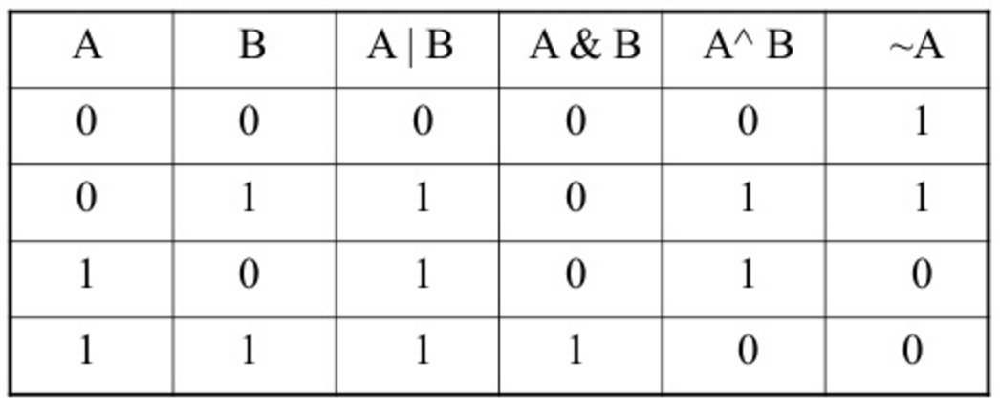

# Resources

**Read or watch:**
- [Operators in C - Part 6](https://www.youtube.com/watch?v=egUyaWtsQc0)
- [Operators in C - Part 7 (Bitwise Operators-II)](https://www.youtube.com/watch?v=LP0acaj3ZLE)
- [Bitwise Operators 1: The AND Operation](https://intranet.alxswe.com/rltoken/y5G3PQyj93BfeKWdKg4qZQ)
- [Bitwise Operators 2: The OR Operation](https://intranet.alxswe.com/rltoken/WO6Vqxl1DUvnKNSX_k19pQ)
- [Bitwise Operators 3: The XOR Operation](https://intranet.alxswe.com/rltoken/a_5cu8KKPivZurpJnXVpAw)
- [Bitwise Operators 4: The Logical Shift Operation](https://intranet.alxswe.com/rltoken/QV4k4fBJ1cYmZubJSZCmGQ)
- [Bit Manipulation](https://intranet.alxswe.com/rltoken/wTSa_lRda5k1rH6JTsSoFw)
- [Bitwise Operators](https://intranet.alxswe.com/rltoken/avGgN526-UnTPvpunGviig)
- [Google](https://intranet.alxswe.com/rltoken/-tOFAtANisYQthxNBmJB8g)
- [Youtube](https://intranet.alxswe.com/rltoken/-PNa1vv5T3tqVVY4PRlGrg)

# Learning Objectives
At the end of this project, you are expected to be able to [explain to anyone](https://intranet.alxswe.com/rltoken/ipbpW8pLm91jdr3YD-AENg), **without the help of Google:**

# General
- Look for the right source of information without too much help
- How to manipulate bits and use bitwise operators

# Requirements

## General
- Allowed editors: `vi`, `vim`, `emacs`
- All your files will be compiled on Ubuntu 20.04 LTS using `gcc`, using the options `-Wall -Werror -Wextra -pedantic -std=gnu89`
- All your files should end with a new line
- A `README.md` file, at the root of the folder of the project is mandatory
- Your code should use the `Betty` style. It will be checked using [betty-style.pl](https://github.com/alx-tools/Betty/blob/master/betty-style.pl) and [betty-doc.pl](https://github.com/alx-tools/Betty/blob/master/betty-doc.pl)
- You are not allowed to use global variables
- No more than 5 functions per file
- The only C standard library functions allowed are `malloc`, `free` and `exit`. Any use of functions like `printf`, `puts`, `calloc`, `realloc` etc… is forbidden
- You are allowed to use [_putchar](https://github.com/alx-tools/_putchar.c/blob/master/_putchar.c)
- You don’t have to push `_putchar.c`, we will use our file. If you do it won’t be taken into account
- In the following examples, the `main.c` files are shown as examples. You can use them to test your functions, but you don’t have to push them to your repo (if you do we won’t take them into account). We will use our own `main.c` files at compilation. Our `main.c` files might be different from the one shown in the examples
- The prototypes of all your functions and the prototype of the function `_putchar` should be included in your header file called `main.h`
- Don’t forget to push your header file
- All your header files should be include guarded

## Quiz questions

### Question #0

What is `98` in base2?

- [ ] 0b01010010

- [ ] 0b01100010

- [ ] 0b10011000

### Question #1

`~ 0x12 =` ?

- [ ] 0x21

- [ ] 0xED

- [ ] 0xFD

- [ ] 0xEE

### Question #2

What is `98` in base16?

- [ ] 0x62

- [ ] 0x98

- [ ] 0x96

### Question #3

`0x13 << 1 =` ?

- [ ] 0x98

- [ ] 0x13

- [ ] 0x26

- [ ] 0x4C

### Question #4

What is `0b001010010` in base10?

- [ ] 84

- [ ] 81

- [ ] 82

- [ ] 83

### Question #5

`0x88 & 0x01 =` ?

- [ ] 0x89

- [ ] 0x00

- [ ] 0x01

- [ ] 0x88

### Question #6

`0x02 >> 1 =` ?

- [ ] 0x02

- [ ] 0x01

- [ ] 0x00

### Question #7

`~ 0x98 =` ?

- [ ] 0x66

- [ ] 0x67

- [ ] 0x68

### Question #8

`0x01 & 0x01 =` ?

- [ ] 0x00

- [ ] 0x01

- [ ] 0x02

### Question #9

`0x01 | 0x00 =` ?

- [ ] 0x00

- [ ] 0x01

- [ ] 0x02

### Question #10

`0x01 | 0x01 =` ?

- [ ] 0x00

- [ ] 0x01

- [ ] 0x02

### Question #11

`0x89 >> 3 =` ?

- [ ] 0x08

- [ ] 0x89

- [ ] 0x44

- [ ] 0x11

- [ ] 0x22

### Question #12

`0x01 & 0x00 =` ?

- [ ] 0x00

- [ ] 0x01

- [ ] 0x02

### Question #13

`0x66 & 0x22 =` ?

- [ ] 0x22

- [ ] 0x44

- [ ] 0x66

### Question #14

`0x89 & 0x01 =` ?

- [ ] 0x89

- [ ] 0x00

- [ ] 0x01

- [ ] 0x88

### Question #15

`0x44 | 0x22 =` ?

- [ ] 0x22

- [ ] 0x44

- [ ] 0x66

### Question #16

What is `0b01101101` in base16?

- [ ] 0xD6

- [ ] 0x36

- [ ] 0x6D

- [ ] 0x7D

- [ ] 0x6E

### Question #17

What is `0x89` in base2?

- [ ] 0b10001000

- [ ] 0b10101001

- [ ] 0b10001001

- [ ] 0b01101001

### Question #18

What is `0x89` in base10?

- [ ] 139

- [ ] 89

- [ ] 135

- [ ] 137

### Question #19

`0x01 << 1 =` ?

- [ ] 0x10

- [ ] 0x00

- [ ] 0x01

- [ ] 0x03

- [ ] 0x02

## Tasks

### 0. 0

Write a function that converts a binary number to an `unsigned int`.

- Prototype: `unsigned int binary_to_uint(const char *b);`
- where `b` is pointing to a string of `0` and `1` chars
- Return: the converted number, or 0 if
	there is one or more chars in the string `b` that is not `0` or `1`
	`b` is `NULL`

```bash
julien@ubuntu:~/0x14. Binary$ cat 0-main.c
#include <stdio.h>
#include "main.h"

/**
 * main - check the code
 *
 * Return: Always 0.
 */
int main(void)
{
    unsigned int n;

    n = binary_to_uint("1");
    printf("%u\n", n);
    n = binary_to_uint("101");
    printf("%u\n", n);
    n = binary_to_uint("1e01");
    printf("%u\n", n);
    n = binary_to_uint("1100010");
    printf("%u\n", n);
    n = binary_to_uint("0000000000000000000110010010");
    printf("%u\n", n);
    return (0);
}
julien@ubuntu:~/0x14. Binary$ gcc -Wall -pedantic -Werror -Wextra -std=gnu89 0-main.c 0-binary_to_uint.c -o a
julien@ubuntu:~/0x14. Binary$ ./a
1
5
0
98
402
julien@ubuntu:~/0x14. Binary$
```

**Repo:**
- GitHub repository: `alx-low_level_programming`
- Directory: `0x14-bit_manipulation`
- File: `0-binary_to_uint.c`

### 1. 1

Write a function that prints the binary representation of a number.

- Prototype: `void print_binary(unsigned long int n);`
- Format: see example
- You are not allowed to use arrays
- You are not allowed to use `malloc`
- You are not allowed to use the `%` or `/` operators

```bash
julien@ubuntu:~/0x14. Binary$ cat 1-main.c
#include <stdio.h>
#include "main.h"

/**
 * main - check the code
 *
 * Return: Always 0.
 */
int main(void)
{
    print_binary(0);
    printf("\n");
    print_binary(1);
    printf("\n");
    print_binary(98);
    printf("\n");
    print_binary(1024);
    printf("\n");
    print_binary((1 << 10) + 1);
    printf("\n");
    return (0);
}
julien@ubuntu:~/0x14. Binary$ gcc -Wall -pedantic -Werror -Wextra -std=gnu89 1-main.c 1-print_binary.c _putchar.c -o b
julien@ubuntu:~/0x14. Binary$ ./b
0
1
1100010
10000000000
10000000001
julien@ubuntu:~/0x14. Binary$
```

**Repo:**
- GitHub repository: `alx-low_level_programming`
- Directory: `0x14-bit_manipulation`
- File: `1-print_binary.c`

### 2. 10

Write a function that returns the value of a bit at a given index.

- Prototype: `int get_bit(unsigned long int n, unsigned int index);`
- where `index` is the index, starting from `0` of the bit you want to get
- Returns: the value of the bit at index `index` or `-1` if an error occured

```bash
julien@ubuntu:~/0x14. Binary$ cat 2-main.c
#include <stdio.h>
#include "main.h"

/**
 * main - check the code
 *
 * Return: Always 0.
 */
int main(void)
{
    int n;

    n = get_bit(1024, 10);
    printf("%d\n", n);
    n = get_bit(98, 1);
    printf("%d\n", n);
    n = get_bit(1024, 0);
    printf("%d\n", n);
    return (0);
}
julien@ubuntu:~/0x14. Binary$ gcc -Wall -pedantic -Werror -Wextra -std=gnu89 2-main.c 2-get_bit.c -o c
julien@ubuntu:~/0x14. Binary$ ./c
1
1
0
julien@ubuntu:~/0x14. Binary$
```

**Repo:**
- GitHub repository: `alx-low_level_programming`
- Directory: `0x14-bit_manipulation`
- File: `2-get_bit.c`

### 3. 11

Write a function that sets the value of a bit to 1 at a given index.

- Prototype: `int set_bit(unsigned long int *n, unsigned int index);`
- where `index` is the index, starting from `0` of the bit you want to set
- Returns: `1` if it worked, or `-1` if an error occurred

```bash
julien@ubuntu:~/0x14. Binary$ cat 3-main.c
#include <stdio.h>
#include "main.h"

/**
 * main - check the code
 *
 * Return: Always 0.
 */
int main(void)
{
    unsigned long int n;

    n = 1024;
    set_bit(&n, 5);
    printf("%lu\n", n);
    n = 0;
    set_bit(&n, 10);
    printf("%lu\n", n);
    n = 98;
    set_bit(&n, 0);
    printf("%lu\n", n);
    return (0);
}
julien@ubuntu:~/0x14. Binary$ gcc -Wall -pedantic -Werror -Wextra -std=gnu89 3-main.c 3-set_bit.c -o d
julien@ubuntu:~/0x14. Binary$ ./d
1056
1024
99
julien@ubuntu:~/0x14. Binary$
```

**Repo:**
- GitHub repository: `alx-low_level_programming`
- Directory: `0x14-bit_manipulation`
- File: `3-set_bit.c`

### 4. 100

Write a function that sets the value of a bit to `0` at a given index.

- Prototype: `int clear_bit(unsigned long int *n, unsigned int index);`
- where `index` is the index, starting from `0` of the bit you want to set
- Returns: `1` if it worked, or `-1` if an error occurred

```bash
julien@ubuntu:~/0x14. Binary$ cat 4-main.c
#include <stdio.h>
#include "main.h"

/**
 * main - check the code
 *
 * Return: Always 0.
 */
int main(void)
{
    unsigned long int n;

    n = 1024;
    clear_bit(&n, 10);
    printf("%lu\n", n);
    n = 0;
    clear_bit(&n, 10);
    printf("%lu\n", n);
    n = 98;
    clear_bit(&n, 1);
    printf("%lu\n", n);
    return (0);
}
julien@ubuntu:~/0x14. Binary$ gcc -Wall -pedantic -Werror -Wextra -std=gnu89 4-main.c 4-clear_bit.c -o e
julien@ubuntu:~/0x14. Binary$ ./e
0
0
96
julien@ubuntu:~/0x14. Binary$
```

**Repo:**
- GitHub repository: `alx-low_level_programming`
- Directory: `0x14-bit_manipulation`
- File: `4-clear_bit.c`

### 5. 101

Write a function that returns the number of bits you would need to flip to get from one number to another.

- Prototype: `unsigned int flip_bits(unsigned long int n, unsigned long int m);`
- You are not allowed to use the `%` or `/` operators

```bash
julien@ubuntu:~/0x14. Binary$ cat 5-main.c
#include <stdio.h>
#include "main.h"

/**
 * main - check the code
 *
 * Return: Always 0.
 */
int main(void)
{
    unsigned int n;

    n = flip_bits(1024, 1);
    printf("%u\n", n);
    n = flip_bits(402, 98);
    printf("%u\n", n);
    n = flip_bits(1024, 3);
    printf("%u\n", n);
    n = flip_bits(1024, 1025);
    printf("%u\n", n);
    return (0);
}
julien@ubuntu:~/0x14. Binary$ gcc -Wall -pedantic -Werror -Wextra -std=gnu89 5-main.c 5-flip_bits.c -o f
julien@ubuntu:~/0x14. Binary$ ./f
2
5
3
1
julien@ubuntu:~/0x14. Binary$
```

**Repo:**
- GitHub repository: `alx-low_level_programming`
- Directory: `0x14-bit_manipulation`
- File: `5-flip_bits.c`

### 6. Endianness

Write a function that checks the endianness.

- Prototype: `int get_endianness(void);`
- Returns: `0` if big endian, `1` if little endian

```bash
julien@ubuntu:~/0x14. Binary$ cat 100-main.c
#include <stdio.h>
#include "main.h"

int main(void)
{
    int n;

    n = get_endianness();
    if (n != 0)
    {
        printf("Little Endian\n");
    }
    else
    {
        printf("Big Endian\n");
    }
    return (0);
}
julien@ubuntu:~/0x14. Binary$ gcc -Wall -pedantic -Werror -Wextra -std=gnu89 100-main.c 100-get_endianness.c -o h
julien@ubuntu:~/0x14. Binary$ ./h
Little Endian
julien@ubuntu:~/0x14. Binary$ lscpu | head
Architecture:          x86_64
CPU op-mode(s):        32-bit, 64-bit
Byte Order:            Little Endian
CPU(s):                1
On-line CPU(s) list:   0
Thread(s) per core:    1
Core(s) per socket:    1
Socket(s):             1
NUMA node(s):          1
Vendor ID:             GenuineIntel
julien@ubuntu:~/0x14. Binary$
```

**Repo:**
- GitHub repository: `alx-low_level_programming`
- Directory: `0x14-bit_manipulation`
- File: `100-get_endianness.c`

### 7. Crackme3

Find the password for [this program](https://github.com/alx-tools/0x13.c).

- Save the password in the file `101-password`
- Your file should contain the exact password, no new line, no extra space

```bash
julien@ubuntu:~/0x14. Binary$ ./crackme3 `cat 101-password`
Congratulations!
julien@ubuntu:~/0x14. Binary$
```

**Repo:**
- GitHub repository: `alx-low_level_programming`
- Directory: `0x14-bit_manipulation`
- File: `101-password`
